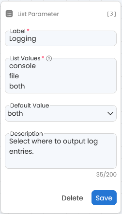

[](http://codeocean.com/product)

---

# Text Notification Capsule

---

### Requirements

1. Create a [Twilio](https://www.twilio.com/docs/usage/tutorials/how-to-use-your-free-trial-account#sign-up-for-your-free-twilio-trial) account
2. Get a [Twilio phone number](https://www.twilio.com/docs/usage/tutorials/how-to-use-your-free-trial-account#get-your-first-twilio-phone-number) in your Twilio account
3. Create the following [secrets](https://docs.codeocean.com/user-guide/secret-management-guide/adding-editing-a-secret-in-the-account-settings-page) in the Account Settings Page (select "Custom Key" when you get to the [Types of Secrets](https://docs.codeocean.com/user-guide/secret-management-guide/adding-editing-a-secret-in-the-account-settings-page#types-of-secrets) section):
    - Twilio phone number
    - Account SID (found in the [API keys & tokens](https://console.twilio.com/us1/account/keys-credentials/api-keys) section of your Twilio account. Make sure to [login to your Twilio account](https://www.twilio.com/login) first)
    - Auth Token (found in the [API keys & tokens](https://console.twilio.com/us1/account/keys-credentials/api-keys) section of your Twilio account. Make sure to [login to your Twilio account](https://www.twilio.com/login) first)
    - 
4. If you initially used a [Twilio trial account](https://www.twilio.com/try-twilio) to evaluate this capsule, you will eventually need to [upgrade your Twilio account](https://console.twilio.com/us1/billing/manage-billing/upgrade) to a regular paid account to use this capsule in a production environment. More information about [Twilio SMS pricing](https://www.twilio.com/en-us/sms/pricing/us).

---
---

## Creating this capsule in *Code Ocean*

#### *Note: if this capsule was duplicated from the Apps Library, you can skip this entire section.The environment is already fully setup for you.

1. Create a new capsule and select **copy from public git**
    - 
2. Enter the url for this github repo
    - `https://github.com/codeocean/text-notification.git`
3. Select a starter environment that has python available. The **Python (3.8.5, miniconda 4.9.2, jupyterlab 3.0.9)** starter environment that came preinstalled with *Code Ocean* will work but any starter environment with python will work.
    - 
4. Click on the gear icon next to `pip` and select `Edit Bulk`.
    - 
5. Copy and paste the following packages into the `Edit Pip Packages` text field.
    ```
    code-ocean-aux-tools
    twilio
    ```
    - 
6. Your environment is setup. The first time you run this capsule, the environment will need to build and you will find a file called `buildLog` in the results folder. Every subsequent time you run this capsule, the environment will not build and the capsule will simply pull the docker images from the registry.

---
---

### Setting Up This Capsule
---
#### Add Secrets To Capsule

*Note: if this capsule was duplicated from the Apps Library, you can skip this section and procede directly to [attaching secrets](#attaching-secrets). The secrets are already in the environment UI, you just merely need to attach your secrets described in the next section.

**Prerequisite**: you should have already created 3 secrets in your account settings page decribed above in the [requirements](#requirements) section.

1. Scroll to the bottom of the Environment UI and click on the `Add secret to capsule` button and select `Custom Key`.
    - 
2. Select you Twilio SID secret. You must select this particular secret first.
3. Repeat step #1 and select Twilio Auth Token secret. You must select this particular secret 2nd.
3. Repeat step #1 and select Twilio Phone secret. You must select this particular secret 3rd.
4. Your secrets should look like the image below. The name of each secret is not important. However, the order of the secrets is. The value for the first secret must be your Twilio SID and so on.
    - 

---
#### Attaching Secrets

*Note: if you needed to do the steps above for [Add Secrets To Capsule](#add-secrets-to-capsule), then you don't need to complete the steps below because you have inherently already attached your secrets during the process.

1. Setup this capsule by [attaching your secrets](https://docs.codeocean.com/user-guide/secret-management-guide/attaching-a-secret-to-a-capsule#attaching-a-secret-to-a-capsule)
    - Go to the Environment UI and scroll to the bottom where the Secrets section is found
    - [Attach your secrets](https://docs.codeocean.com/user-guide/secret-management-guide/attaching-a-secret-to-a-capsule#attaching-a-secret-to-a-capsule) to this capsule.
    - Make sure you attach your secrets that correspond to the secrets setup in this capsule (e.g. ensure you attach your Twilio phone number secret for the capsule secret labelled Twilio Phone, etc.)

---
#### Creating App Panel

*Note: if you duplicated this capsule from the Apps Library, this capsule will already have an app panel which means you can skip this section.

To effectively use this capsule to receive notifications in a pipeline, you will want to setup an App Panel here in the capsule so that it will be available in the pipeline you add this capsule to.


1. Click on the `App Builder` tab on the lefthand side.
    - 

2. Click on either the `Create App` button or the gear icon in the top right.
    - 

3. Fill in the `Subtitle` and `Instructions` fields in the `General` section.
    - 

4. Scroll down to the `Parameters` section and add a `text parameter` by clicking on the icon.
    - 

5. Complete the `Phone` text parameter.
    - Fill out the `Label`, `Default Value`, and `Description` fields. Make sure you select the digit `0` as the default value for this `Phone` text parameter.
    - 

6. Add another text parameter and complete the `Message` text parameter.
    - 

7. Add a `list parameter`.
    - 

8. Complete the `Logging` list parameter.
    - Fill out the `Label`, `List Values`, `Default Value`, and `Description` fields.
    - 

9. Add another `List Parameter` and complete the `Logging Level` list parameter.
    - The values needed for the `List Values` section are
    ```
    debug
    info
    warning
    error
    critical
    ```
    - Here is the description section if you want to use the same description as we are using
    ```
    The log level to start tracking (e.g. warning means that events listed under warning and greater severity will be logged). This parameter is only relevant if logging is turned on.
    ```
    - 

10. Click on the `Finish` button at the bottom. Your App Panel is now setup.
    - 

---
---

### How to use (testing this capsule)

1. Click on App Builder on the left (If your App Builder is empty, see the section above for [Creating App Panel](#creating-app-panel)).
2. Enter the phone number to send the text notification to.
3. Enter the message to include in the text notification.
4. Select the logging options if you would like to include some logging information with the output.
5. Run this capsule to confirm it is setup correctly.

---

### How to use in a Pipeline

This capsule can be used in a Code Ocean Pipeline to send a notification at any point in a Pipeline where you attach this capsule. This can be after a critical step in a pipeline completes or after the entire pipeline completes or both. You are able to add as many copies of this capsule as fits your needs.

1. Add this text notification capsule to the Pipeline UI.
2. Connect this capsule at the point in the pipeline where you want to be notified. In the example below, as soon as the `Create metadata` capsule completes, the text notification capsule will run and send the text notification.
    - 
3. Adjust any settings for this text notification capsule using the Pipeline App Builder. You will likely want to set the phone number to send the notification to and also set the notification message.
4. Repeat steps 1,2, and 3 to receive additional notifications at any other step in your pipeline.

---

[Code Ocean](https://codeocean.com/) is a cloud-based dry lab for scientific computing with a focus on guaranteeing reproducibility, collaboration and organizing scientific projects. Code Ocean automates best practices allowing users of the platform to focus on science yet follow best practices.<br /><br />
[](https://www.codeocean.com)
